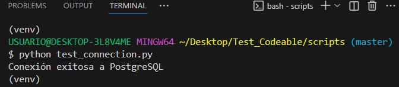
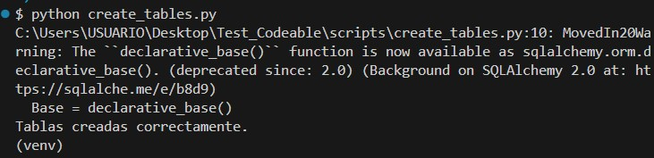
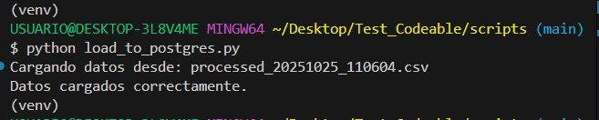
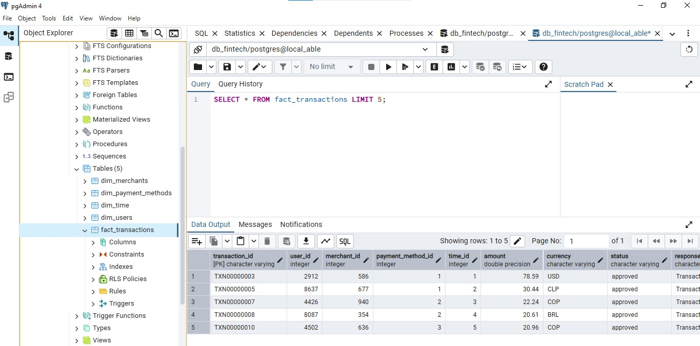

# Pipeline de datos / Data Engineering 

## Evaluación Técnica Integral

**Autor:** [Yuri Díaz]  

### Descripción

El objetivo de este repositorio es diseñar e implementar un pipeline de datos end-to-end para una fintech latinoamericana, abarcando desde la ingesta y limpieza de datos hasta el modelado dimensional y la detección de fraude.

A continuación se documentan las fases completadas, las decisiones técnicas tomadas y el razonamiento detrás de cada etapa del desarrollo.

---

# Preparación de entorno virtual:


Crear un entorno virtual de trabajo utilizando los siguientes comandos:

**py -m venv venv** 

 Otras opciones en lugar de **py** pueden ser **python** o **python3.**

Activamos el entorno con uno de estos tres posibles comandos:

1. source venv/Scripts/activate
2. source venv\Scripts\activate
3. source venv/bin/activate | Linux y Mac


## Instalación de dependencias
```bash
pip install -r requirements.txt
```
# Fase 1: Data Ingestion (Generación y Organización de Datos)

## 📋 Descripción general

En esta primera fase se configuró la base del *Data Lake local* y se ejecutó el proceso de generación automática de transacciones.  
El objetivo fue establecer una estructura organizada para la ingesta continua de datos y preparar el entorno para las siguientes fases del pipeline ETL.

El archivo `main.py` se encarga de generar archivos CSV con transacciones simuladas cada 60 segundos dentro de la carpeta `transactions/`.

Durante esta fase:
- Se ejecutó `main.py` para verificar la creación automática de los archivos CSV.

## Ejecución
```bash
python3 main.py
```

- Se verificó que los archivos CSV fueran generados correctamente por main.py y que su estructura (columnas y formato) fuera consistente entre los distintos archivos.


### 📋 Inspección general de archivos

El script `inspect_transactions.py` permite analizar los archivos CSV generados en la carpeta `transactions/`.  
Este script realiza validaciones básicas, como verificar la consistencia de las columnas y detectar posibles errores en los datos.

### Ejecución
```bash
python3 inspect_transactions.py
```

- El script genera un reporte con los resultados de la inspección, indicando si los archivos cumplen con los estándares definidos.


# Fase 2. ETL Pipeline - Limpieza y Detección de Fraude

Creación y aplicación de funciones:

## Función clean_data(df): 
* Limpia y valida el DataFrame de transacciones crudas.
* Elimina valores nulos y duplicados en las columnas críticas.
* Estandariza formatos de texto (mayúsculas, sin espacios) en campos clave como currency, país, etc.
* Convierte tipos de datos (numéricos y fechas) correctamente.
* Maneja outliers en la columna amount usando el método IQR.
* Prepara los datos para la detección de fraude, pero no guarda el DataFrame limpio directamente; lo pasa a la siguiente etapa del pipeline.

**Decisión sobre la limpieza de datos**.
Durante la fase de limpieza de datos, se evaluaron dos enfoques:

**Limpieza de todas las columnas:** 

 **Ventaja:** Garantiza máxima calidad y consistencia en todos los campos.

**Desventaja:** Puede eliminar una gran cantidad de registros por valores faltantes o inconsistentes en columnas poco relevantes, reduciendo el volumen de datos útil para análisis y detección de fraude.

Datos totales después de limpieza:

* Cantidad de filas originales: 100
* Cantidad de filas después de limpieza: 54


**Limpieza solo de columnas críticas:**

**Ventaja:** Preserva más registros, enfocándose en los campos esenciales para el análisis y la detección de transacciones sospechosas.

**Desventaja:** Puede dejar inconsistencias menores en columnas no críticas, pero no afecta la calidad del análisis principal.

**Decisión tomada:**
Se optó por limpiar únicamente las columnas críticas para el proceso de análisis y detección de fraude:

* transaction_id
* user_id
* merchant_id
* amount
* currency
* status
* timestamp
* payment_method
* country

Esta decisión permite mantener la mayor cantidad de datos posible, asegurando la calidad en los campos relevantes y facilitando la detección de patrones sospechosos sin sacrificar volumen de información.

## Justificación numérica:

Haciendo limpieza de columnas críticas los resultados son mejores: 
* Cantidad de filas originales: 100
* Cantidad de filas después de limpieza: 93

## Función detect_suspicious_transactions(df):

* Recibe el DataFrame limpio y detecta transacciones sospechosas según criterios definidos.

**Criterios principales:**

* Montos inusualmente altos (percentil 99).
* Múltiples intentos fallidos del mismo usuario.
* Flaggeo de transacciones declined con códigos de seguridad (usando tanto response_message que contenga “security” como response_code igual a 65).
* Patrones anómalos (transacciones rápidas, horarios inusuales).
* Transacciones internacionales de alto riesgo.

**Nota:**
Lo métodos estadísticos aplicados y las regflas basadas en patrones típicos cumplen con lo solicitado. 
Para alcanzar un nivel de optimización superior y una calibración dinámica de los criterios, sería recomendable desarrollar y evaluar un modelo de machine learning supervisado.
No obstante, este procedimiento excede el alcance y las instrucciones del reto actual, por lo que la solución presentada prioriza robustez y flexibilidad mediante reglas basadas en el análisis estadístico de los datos.

* La función retorna dos DataFrames:
**normal_df:** transacciones normales, que se guardan en la carpeta **processed**. Y el DataFrame
**suspicious_df:** transacciones sospechosas, que se guardan en la carpeta **suspicious**.

## Testeo de funciones:
La carpeta scripts contiene dos archivos: 
* **test_clean.py** que prueba la función clean_data. 
* **test_suspicious.py** que prueba la función detect_suspicious_transactions. 

### Fase 3: Data Warehouse - Modelado y Almacenamiento
**Objetivo:** Diseñar e implementar un modelo dimensional para análisis

* **inspect_processed.py**: Este script permite inspeccionar los archivos CSV limpios generados por el pipeline ETL y almacenados en la carpeta **processed**. Su objetivo es mostrar las columnas disponibles, los tipos de datos y la cantidad de valores nulos en los datos finales, facilitando el diseño del modelo dimensional y la creación de las tablas en el Data Warehouse.

**Uso recomendado:**
Ejecuta este script antes de definir el esquema de las tablas en PostgreSQL para asegurarte de que el modelo dimensional se adapte a los datos realmente disponibles.

Comando de ejecución:

```bash
python scripts/inspect_processed.py
```

* **test_connection.py**
Este script realiza una prueba simple de conexión con la base de datos PostgreSQL utilizando SQLAlchemy.
Permite verificar rápidamente que las credenciales, el servidor y la base de datos están configurados correctamente antes de ejecutar cualquier proceso de carga o consulta.

Uso recomendado:
1. Antes de ejecutar, asegúrate de tener PostgreSQL instalado y en ejecución.
2. Crea un archivo `.env` en la raíz del proyecto (no incluido en el repositorio) con tus credenciales:
DB_USER=tu_usuario
DB_PASS=tu_contraseña
DB_NAME=tu_base_de_datos
DB_HOST=localhost
DB_PORT=5432
3. Edita `test_connection.py` para reemplazar la contraseña por la tuya.

5. Salida esperada:

✅ Conexión exitosa a PostgreSQL



Comando de ejecución:

```bash
python scripts/test_connection.py
```

### **Criterio del modelado**

**Descripción**

Este proyecto implementa un Data Warehouse para transacciones fintech usando PostgreSQL y SQLAlchemy.

Las columnas seleccionadas para cada tabla se eligieron siguiendo estos criterios:

* Evitar redundancia: Los identificadores y atributos repetidos se ubicaron en dimensiones.
* Facilitar el análisis: Se incluyeron métricas y atributos clave en la tabla de hechos.
* Adaptación a los datos reales: El modelo se basa en las columnas realmente disponibles tras la limpieza.


Se utiliza un **modelo estrella (star schema)** con una **tabla de hechos** (fact_transactions) y **dimensiones** (dim_users, dim_merchants, dim_payment_methods, dim_time) para facilitar análisis OLAP y detección de fraude.

### Modelo Estrella

**Tabla de hechos** (fact_transactions): almacena cada transacción con métricas y claves a dimensiones.

| Columna           | Tipo                               | Descripción                |
| ----------------- | ---------------------------------- | -------------------------- |
| transaction_id    | String (PK)                        | ID único de la transacción |
| user_id           | Integer (FK → dim_users)           | Usuario asociado           |
| merchant_id       | Integer (FK → dim_merchants)       | Comercio asociado          |
| payment_method_id | Integer (FK → dim_payment_methods) | Método de pago             |
| time_id           | Integer (FK → dim_time)            | Referencia temporal        |
| amount            | Float                              | Monto de la transacción    |
| currency          | String                             | Moneda                     |
| status            | String                             | Estado de la transacción   |
| response_message  | String                             | Mensaje del procesador     |
| attempt_number    | Integer                            | Número de intentos         |


**Dimensiones:** describen atributos de usuarios, comercios, métodos de pago y tiempo.

Permite consultas rápidas y agregaciones: monto total por usuario, transacciones por día, análisis de intentos fallidos, etc.

Cada dimensión refleja únicamente los atributos existentes en los datos finales:

* **dim_users → user_id, country**

* **dim_merchants → merchant_id, country**

* **dim_payment_methods → payment_method**

* **dim_time** → descomposición de timestamp en year, month, day, hour, minute, second y settlement_date (calculada durante la carga)

**Script de creación de tablas**

El script **create_tables.py** utiliza SQLAlchemy para definir y crear automáticamente la estructura de las tablas en PostgreSQL. Solo necesitas ejecutarlo una vez para preparar la base de datos antes de cargar los datos.

Comando de ejecución:

```bash
python scripts/create_tables.py
```

Si la ejecución falla saldrá un mensaje de error y si es exitosa, verás el mensaje:

"Tablas creadas correctamente."



Y en PostgreSQL ahora aparecen las tablas listadas:


**Ventajas del enfoque**

* **Reproducibilidad:** Cualquier usuario puede levantar la estructura ejecutando el script.
**Flexibilidad:** El modelo se adapta a los datos finales y permite análisis por usuario, comercio, método de pago y tiempo.
* **Buenas prácticas:** El uso de SQLAlchemy facilita futuras migraciones y mantenimiento.

**Nota:**
Recuerda modificar la contraseña en la cadena de conexión del script antes de ejecutarlo.

**Script de carga de datos**

El script **load_to_postgres.py** utiliza SQLAlchemy para cargar automáticamente los datos limpios desde la carpeta `processed/` en las tablas del Data Warehouse en PostgreSQL. El proceso recorre cada registro del archivo CSV más reciente, valida y transforma los datos según el modelo dimensional, y los inserta en las tablas correspondientes (dimensiones y hechos).

Solo necesitas ejecutarlo después de haber creado las tablas con `create_tables.py`. El script gestiona la inserción evitando duplicados en las dimensiones y asegurando la integridad referencial entre las tablas.

Comando de ejecución:

```bash
python scripts/load_to_postgres.py
```

Si la ejecución es exitosa, verás el mensaje:

"Datos cargados correctamente."



Y en Postgres estarán cargados los datos en las tablas:



En caso de errores (por ejemplo, problemas de conexión o datos inválidos), se mostrará un mensaje explicativo para facilitar la depuración.

**Configuración y recomendaciones:**

* Antes de ejecutar, asegúrate de que PostgreSQL esté instalado y en funcionamiento.
* Verifica que la cadena de conexión en el script tenga tus credenciales correctas.
* Si el script detecta un `timestamp` inválido en alguna fila, esa fila será ignorada y se mostrará un mensaje indicando el `transaction_id` afectado.
* El proceso garantiza que solo se inserten registros válidos y consistentes con el modelo dimensional.

**Ventajas del enfoque**

* **Automatización:** El proceso de carga es reproducible y no requiere intervención manual.
* **Integridad:** Solo se insertan registros válidos y consistentes con el modelo dimensional.
* **Escalabilidad:** El script está optimizado para manejar grandes volúmenes de datos de manera eficiente.
